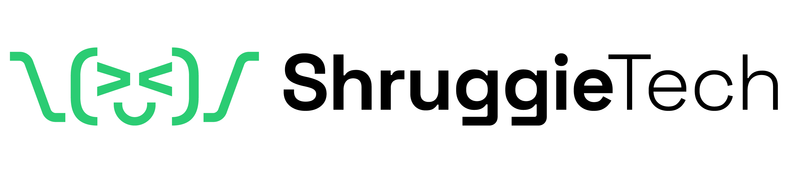

# ShruggieTech Brand System

<picture>
  <source media="(prefers-color-scheme: dark)" srcset="brands/shruggietech/assets/logo-darkbg.png">
  <source media="(prefers-color-scheme: light)" srcset="brands/shruggietech/assets/logo-lightbg.png">
  
</picture>

[](https://github.com/shruggietech/shruggie-brand/actions/workflows/build.yml) [](https://github.com/shruggietech/shruggie-brand/releases/latest) [](LICENSE)

This repository contains the ShruggieTech brand system: the `shruggie-brandbuilder` skill, brand sources, and the pipeline that builds and verifies release assets. Explore current identities, assets, and guidance on the [brand site](https://brand.shruggie.tech/).

## Get the current release

Open the [latest official release](https://github.com/shruggietech/shruggie-brand/releases/latest) and choose the asset for your workflow:

| Use | Release asset |
| --- | --- |
| Claude Customize upload | The `shruggie-brandbuilder` `.skill` file |
| Codex or repository vendoring | The `shruggie-brandbuilder` portable `.zip`, starting with its `AGENTS.md` |
| A released brand kit | A brand-named `.zip` file listed in that release |

The release includes `SHA256SUMS` for exact-download verification. A showcased brand may not have an archive in every release; the release asset list is authoritative. Source on `main` can be newer than the latest published release, so use the release page rather than a source version number to identify downloadable assets.

## Browse the brand system

The [brand site](https://brand.shruggie.tech/) is the current catalog of published identities and their guidelines, assets, and downloads. The [latest official release](https://github.com/shruggietech/shruggie-brand/releases/latest) is the inventory of downloadable archives.

## Build

Follow the setup in [CONTRIBUTING.md](CONTRIBUTING.md), then build the production kits:

```powershell
python scripts/build_all.py
```

Build one kit by slug:

```powershell
python scripts/build_all.py BRAND_SLUG
```

Generated output is written to `dist/` and is intentionally ignored by Git.

The [contributor guide](CONTRIBUTING.md) describes validation and publication of source changes.

## Add a brand

Read the [variance contract](skill/references/00-variance-contract.md), then add source files only under `brands/<slug>/`. Register the kit in the site and build script, then run the complete validation. Generated chart colors must satisfy the canon's pairwise hue-separation rule, and every text-bearing color pair must clear WCAG 2.1 AA. Tests that require synthetic brand data must create it in a temporary directory.

## Licensing

Code, templates, reference documentation, and site source are licensed under [Apache License 2.0](LICENSE). Attribution is in [NOTICE](NOTICE). Names, wordmarks, logos, endorsement lockups, and logo path geometry remain reserved as described in [LICENSE-BRAND.md](LICENSE-BRAND.md). Bundled fonts retain the SIL Open Font License 1.1 terms included with the font sources.

## Participate

Read [CONTRIBUTING.md](CONTRIBUTING.md) to propose a change, [SECURITY.md](SECURITY.md) to report a vulnerability, and [CODE_OF_CONDUCT.md](CODE_OF_CONDUCT.md) for community expectations. For ordinary help or a defect report, [open an issue](https://github.com/shruggietech/shruggie-brand/issues/new/choose).
