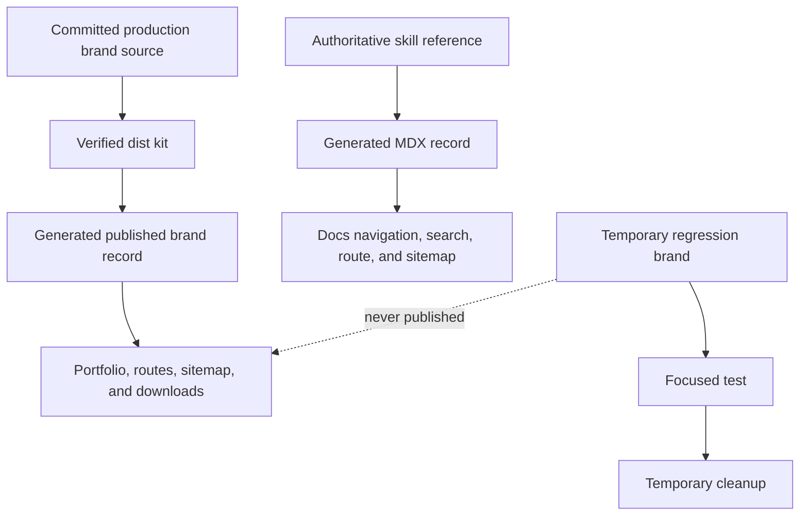

# Data Model: Brand Platform Refresh

## Published Brand Record

Derived from one verified production kit and stored only in generated site data.

| Field | Type | Rule |
| --- | --- | --- |
| `slug` | string | Unique URL-safe identifier matching the generated kit directory |
| `title` | string | Human-facing brand name from generated `brand.json` |
| `kind` | string | Must not equal `fixture`; non-production test data is rejected from publication |
| `descriptor` | string | Public summary from generated `brand.json` |
| `idea` | string | Brand idea from generated `brand.json` |
| `version` | string | Generated kit version |
| `accent` | hex color | Dark-surface identity accent |
| `accentAccessible` | hex color | Verified accessible foreground alternative |
| `logo` | path | Generated horizontal logo path |
| `icon` | path | Generated square mark path used by portfolio cards |
| `specimen` | path | Generated specimen path |

Validation rejects duplicate slugs, missing required fields, non-absolute public-path forms, missing source assets, or records whose source is outside the production brand collection.

## Documentation Record

Derived from one authoritative `skill/references/*.md` source and materialized as ignored MDX.

| Field | Type | Rule |
| --- | --- | --- |
| `slug` | string | Stable source filename stem |
| `title` | string | First source H1 with public terminology applied |
| `description` | string | Concise plain-text summary derived from the first suitable prose paragraph |
| `order` | integer | Stable source filename order |
| `sourcePath` | repository path | Authoritative skill reference path, never a public workstation path |
| `body` | MDX | Source body with H1 removed, frontmatter added, and public-only terminology rewrite |

The documentation index is site-owned navigation content generated alongside the records. Literal code spans, fenced code, schema keys, and compatibility identifiers retain their exact source text.

## Route Metadata Record

| Field | Type | Rule |
| --- | --- | --- |
| `pathname` | string | One canonical trailing-slash public route |
| `title` | string | Route-specific human title using the ShruggieTech template |
| `description` | string | Route-specific summary |
| `canonical` | absolute URL | HTTPS address under `brand.shruggie.tech` |
| `indexable` | boolean | False for internal or absent surfaces; only true routes enter sitemap |
| `socialImage` | asset reference | Canonical 1280 by 640 ShruggieTech preview with alt text |

## Temporary Regression Brand

Created only inside an operating-system temporary directory during a test. It may be based on a copy of an existing production source, receives a test-only slug, and is passed directly to the focused generator under test. It is never stored beneath `brands/`, discovered by `build_all.py`, copied by `prepare_site.py`, or included by release packaging.

## State Flow

