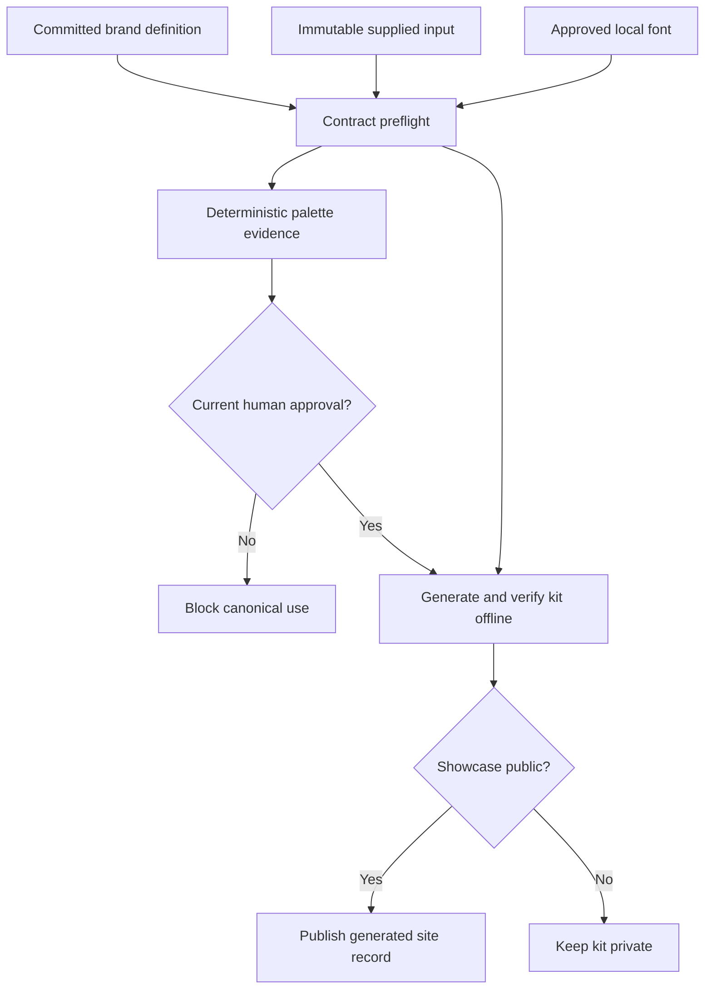

# Data Model: Ownership-Neutral Authoritative Inputs

## Affiliation Contract

| Field | Type | Rule |
| --- | --- | --- |
| `ownership` | enum | `shruggietech-owned` or `third-party`; required with no default |
| `showcase` | enum | `public` or `private`; required independently of ownership |
| `parent` | string or null | `ShruggieTech` only for an owned child; null for the parent brand and third-party work |
| `inheritance` | enum | `shruggietech-house` or `independent`; required independently of ownership |
| `endorsement` | enum | `shruggietech-project` only for owned children, otherwise `none` |
| `service_credit` | enum | `brand-system-by-shruggietech` only for an explicitly credited third party, otherwise `none` |

Derived output is either the owned endorsement, the neutral service credit, or no affiliation line. A record cannot produce both.

House inheritance derives emphasis and action semantics from the ShruggieTech orange tokens. Independent inheritance requires a `semantic_colors` object containing explicit six-digit `emphasis` and `action` values, and generated outputs do not receive the ShruggieTech orange pair.

## Typography Contract

| Field | Type | Rule |
| --- | --- | --- |
| `mode` | enum | `house` or `fixed`; required |
| `families` | object | Exactly the `display`, `body`, and `mono` roles, each with a family name and non-empty weights |
| `faces` | array | Required and non-empty for fixed mode; omitted for house mode |

### Font Face Record

| Field | Type | Rule |
| --- | --- | --- |
| `role` | enum | `display`, `body`, or `mono` |
| `path` | path | Kit-relative file under `fonts/`, contained after resolution |
| `weight` | integer | 1 through 1000 and declared by the role family |
| `style` | enum | `normal`, `italic`, or `oblique` |
| `format` | enum | `ttf`, `otf`, or `woff2`, matching file and measured binary |
| `sha256` | digest | Exact lowercase SHA-256 of the local binary |
| `license` | string | Non-empty SPDX identifier or reviewed license label |
| `provenance` | string | Authoritative source URL or repository-relative source description, without secrets |
| `usage_status` | enum | `approved` only for generated use |

Fixed mode requires at least one outline-capable face (`ttf` or `otf`) for every role and a face for every declared weight and style used by generated output. Variable fonts are rejected in S007.

## Authoritative Input

| Field | Type | Rule |
| --- | --- | --- |
| `id` | string | Unique stable lowercase identifier |
| `role` | enum | `mark`, `reduced-mark`, `wordmark`, or `reference-art` |
| `path` | path | Kit-relative contained file beneath the staged brand source |
| `format` | enum | `svg`, `png`, `jpeg`, or `webp`, matching measured content |
| `sha256` | digest | Exact lowercase SHA-256 of the unchanged source bytes |
| `color_profile` | enum | `srgb`, `embedded`, `none`, or `unknown` |
| `usage_status` | enum | `approved` or `reference-only` |
| `license` | string | Non-empty reviewed license or permission label without contract text |
| `approved_transformations` | array | Closed values such as `embed-unchanged`, `recolor-mask`, or `palette-analysis`; empty means no transformations |

Roles are unique except `reference-art`, which may appear more than once under distinct identifiers. Active or externally dependent SVG is invalid. The input file is never rewritten.

## Palette Evidence

| Field | Type | Rule |
| --- | --- | --- |
| `input_id` | string | References one authoritative input |
| `source_sha256` | digest | Must match the validated input |
| `method` | enum | `raster-exact-rgba-v1` or `svg-solid-paints-v1` |
| `visible_samples` | integer | Number of visible raster pixels or solid paint occurrences |
| `transparent_samples_ignored` | integer | Fully transparent raster pixels excluded from evidence |
| `candidates` | array | Ranked `{hex, count}` records sorted by descending count then hex |
| `limitations` | array | Profile, sampling, antialiasing, gradient, or unsupported-paint notes |

Evidence is generated and ignored by Git. It does not itself change canonical colors.

## Palette Approval

| Field | Type | Rule |
| --- | --- | --- |
| `input_id` | string | References the analyzed authoritative input |
| `source_sha256` | digest | Must equal current validated source hash |
| `selected_candidate` | hex | Must appear in current deterministic evidence |
| `approved_by` | string | Human operator role or identifier, without sensitive agreement data |
| `approved_on` | date | ISO `YYYY-MM-DD` |

If a canonical accent cites a palette approval, any source-hash or candidate mismatch makes the approval stale and blocks publication.

## Ingestion Request

| Field | Type | Rule |
| --- | --- | --- |
| `source` | string | Existing local path or HTTPS URL |
| `destination` | path | Repository-relative path strictly beneath `assets/fonts/` |
| `expected_sha256` | digest | Required before reading the source |
| `family` | string | Expected measured family |
| `weight` | integer | Expected measured weight |
| `style` | enum | Expected measured style |
| `license` | string | Required reviewed license label |
| `provenance` | string | Public-safe source description |

The ingestion state sequence is `requested -> temporary -> measured -> approved -> atomically placed`. Any error transitions to `rejected` and removes temporary state without changing an existing destination.

## Publication Record

The generated site record includes the existing portfolio fields plus `ownership`, `parent`, `endorsement`, `serviceCredit`, and `showcase`. Only `showcase == public` records are copied into `site/public` or emitted to generated portfolio data.

## State Flow

