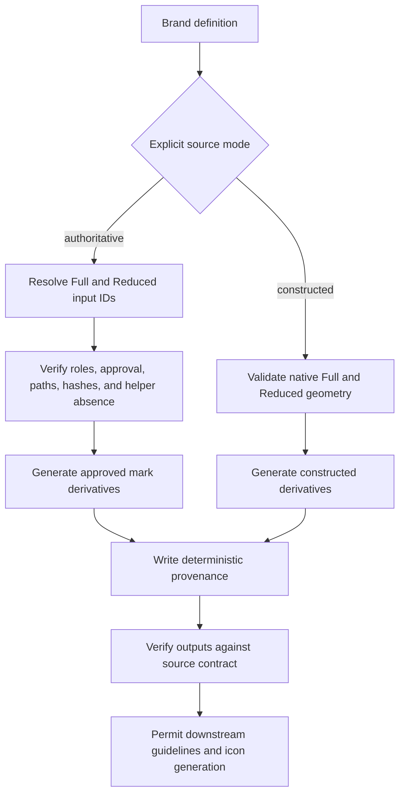

# Data Model: Authoritative Logo Source Contract

## Logo Source Contract

| Field | Type | Rule |
| --- | --- | --- |
| `source_mode` | enum | Required, exactly `constructed` or `authoritative` |
| `authoritative_input_ids` | object | Required only in authoritative mode; exactly `full` and `reduced` |
| `paths.full` | array | Constructed mode: non-empty native elements; authoritative mode: exactly one bound image element |
| `paths.reduced` | array | Constructed mode: non-empty native elements; authoritative mode: exactly one bound image element |

Constructed mode rejects `authoritative_input_ids` and approved `mark` or `reduced-mark` source records. Authoritative mode requires both bindings and rejects `build/mk_paths.py`.

## Variant Binding

| Field | Type | Rule |
| --- | --- | --- |
| `variant` | enum | `full` or `reduced` |
| `input_id` | identifier | References exactly one authoritative input |
| expected role | derived enum | Full requires `mark`; Reduced requires `reduced-mark` |
| source path | derived path | Image element source equals the referenced input path |
| mask method | enum | Raster uses `alpha` or `luminance`; SVG embeds unchanged |
| placement | rectangle | Finite x, y, width, and height preserving source aspect ratio |

## Authoritative Input Extension

The existing record remains immutable. `approved_transformations` uses the closed set:

| Transformation | Meaning |
| --- | --- |
| `embed-unchanged` | Embed exact source bytes without paint or geometry changes |
| `recolor-mask` | Replace color through the declared source mask without changing mask topology |
| `resize` | Scale proportionally into a declared placement rectangle |
| `place-in-lockup` | Position the derived mark beside or above an approved wordmark |
| `palette-analysis` | Measure source colors for advisory evidence only |

## Logo Derivative Record

| Field | Type | Rule |
| --- | --- | --- |
| `path` | relative path | Unique output beneath `logos/` |
| `kind` | enum | `mark`, `lockup`, or `wordmark` |
| `variant` | enum or null | `full`, `reduced`, or null for wordmark-only output |
| `colourway` | enum | Existing generated colorway name |
| `source_mode` | enum | Mirrors the validated brand contract |
| `input_id` | identifier or null | Required for authoritative mark and lockup records |
| `source_sha256` | digest or null | Required and current when `input_id` is present |
| `transformations` | ordered array | Unique closed values, each approved by the source |
| `embedded_metadata` | boolean | True for authoritative SVG mark and lockup outputs |

Records sort by path and serialize with stable key ordering. No absolute paths or confidential usage evidence appear.

## Provenance Index

| Field | Type | Rule |
| --- | --- | --- |
| `schema_version` | integer | `1` for S016 |
| `brand` | identifier | Equals the kit slug |
| `source_mode` | enum | Equals the logo source mode |
| `derivatives` | array | One record for every generated logo SVG and PNG, sorted by path |

## Validation State Flow

